# Frizerski salon – Informacioni sistem za upravljanje frizerskim salonima

Dobrodošli u **Frizerski salon** – aplikaciju namijenjenu za efikasno upravljanje radom frizerskog salona, sa posebnim fokusom na korisničko iskustvo, personalizaciju i podršku za dvije korisničke uloge: **radnike** i **administratora**.

## Uvod

Ovaj priručnik je namijenjen svim korisnicima sistema Frizerski salon – zaposlenima i administratorima – i objašnjava kako koristiti aplikaciju za efikasno upravljanje uslugama, rezervacijama i računima.  
Aplikacija omogućava:
- Vođenje kataloga usluga (šišanja, farbanje, tretmani)
- Kreiranje i praćenje rezervacija
- Automatsko izdavanje računa nakon završetka usluge
- Upravljanje korisnicima sistema

Radnici mogu kreirati rezervacije, pregledati postojeće i izdavati račune. Administrator ima dodatne privilegije: može upravljati uslugama (dodavati, brisati, uređivati) i korisnicima sistema.

Svi korisnici imaju pristup personalizaciji – mogu promijeniti **temu interfejsa** (Svijetla, Tamna, Roze) i **jezik aplikacije** (srpski / engleski). Sve postavke se automatski čuvaju i vraćaju prilikom naredne prijave.

---

## Prijavljivanje na sistem

Nakon pokretanja aplikacije, korisniku se prikazuje prozor za prijavu, na kom se očekuje da unese **korisničko ime** i **lozinku**.

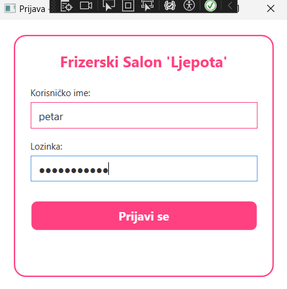

Ukoliko kredencijali nisu ispravni, pojavljuje se poruka:

> **Pogrešno korisničko ime ili lozinka!**
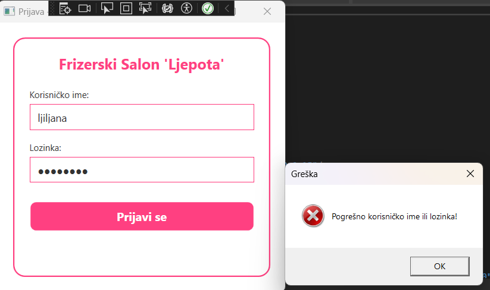

Nakon uspješne prijave, korisniku se prikazuje **glavni meni** prilagođen njegovoj ulozi.

---

## Glavni meni

Nakon prijave, otvara se **glavna stranica „Usluge u toku“**, koja prikazuje sve aktivne usluge sa mogućnošću **završavanja** i **automatskog izdavanja računa**.

Radnici vide sledeće opcije u meniju:
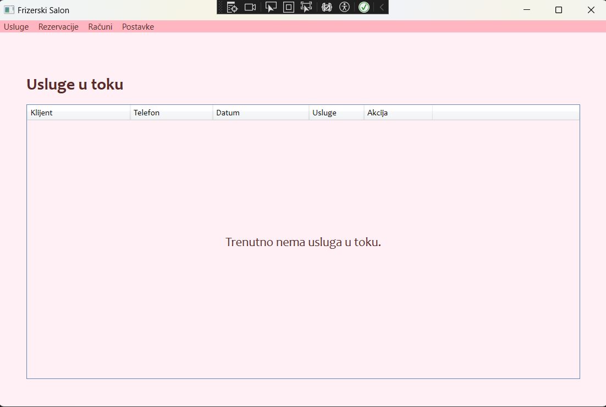
- **Usluge** → Pregled usluga
- **Rezervacije** → Kreiranje i pregled rezervacija
- **Računi** → Pregled računa i pretraga po datumu

Administrator vidi sve ove opcije, plus:
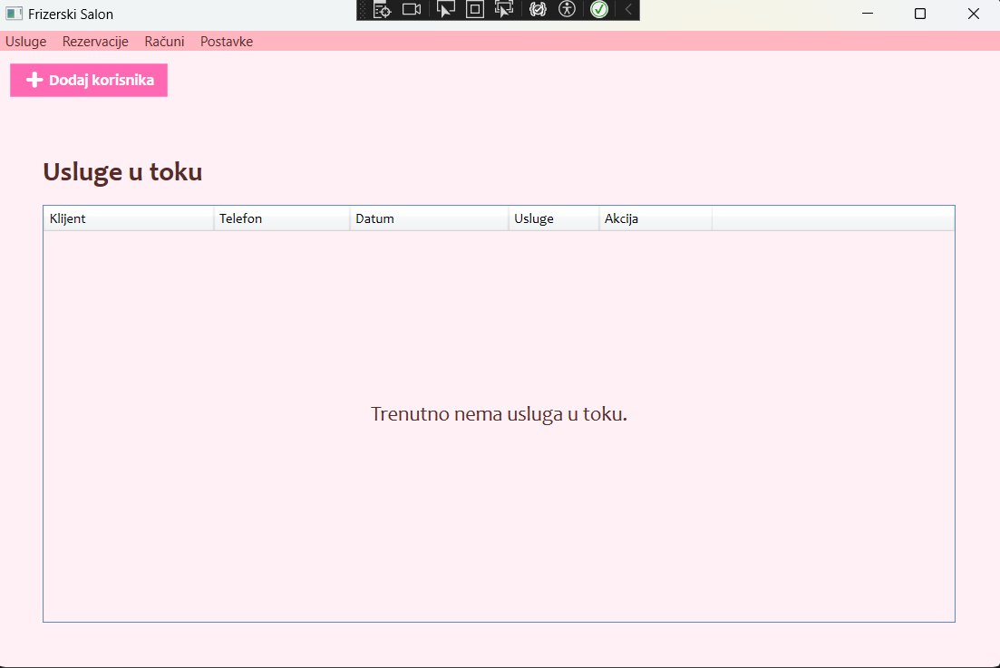
- **Postavke** → Upravljanje korisnicima, promena teme i jezika

---

## Usluge

Aplikacija održava katalog svih usluga koje salon nudi:
- Naziv (npr. „Žensko šišanje“, „Farbanje kose“)
- Šifra
- Opis
- Cijena (KM)
- Trajanje (minuti)

Administrator može:
- **Dodati novu uslugu** – unosom svih potrebnih podataka
- **Obrisati uslugu** – klikom na ❌ pored usluge
- **Pretražiti uslugu po nazivu** - unosom željene usluge
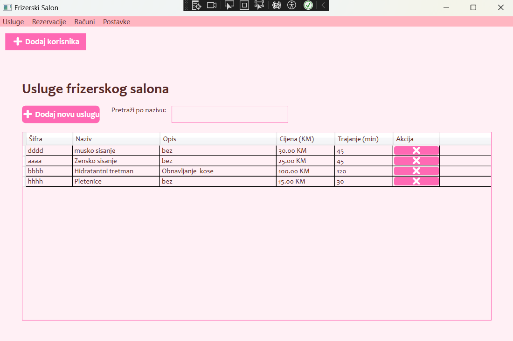

Radnici mogu samo **pregledati** i **pretraživati usluge** po nazivu.

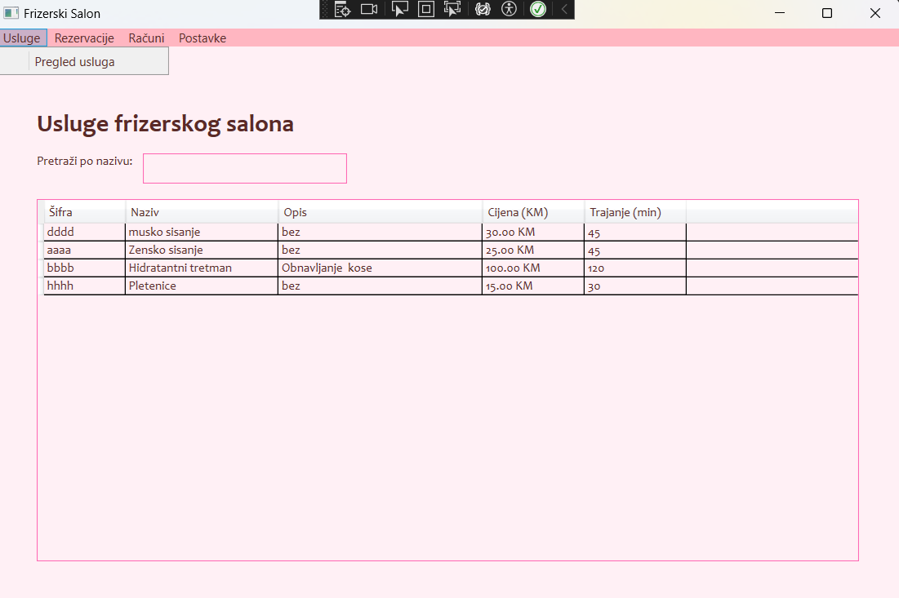

---

## Rezervacije

### Kreiranje rezervacije

Radnici mogu kreirati novu rezervaciju za klijenta:
- Unos imena klijenta
- Telefon
- Datum i vreme
- Izbor usluge

Nakon kreiranja, rezervacija se automatski prikazuje u **„Usluge u toku“**.

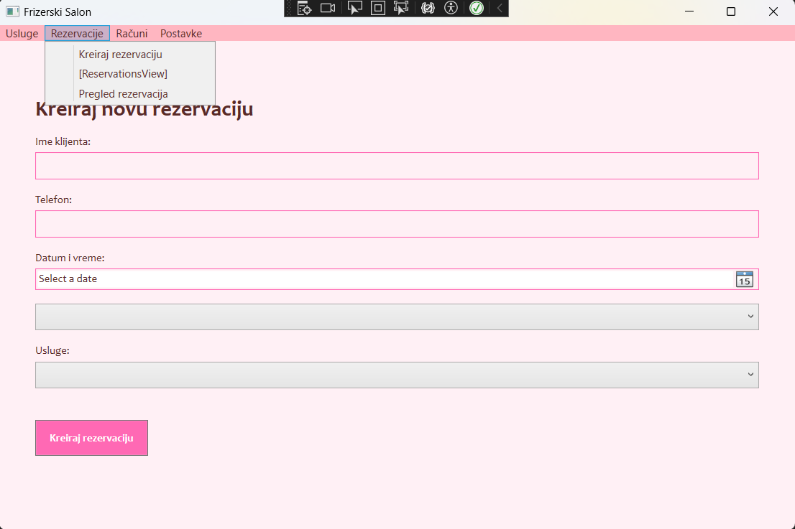

### Pregled rezervacija

Svi korisnici mogu pregledati postojеće rezervacije sa:
- Imenom klijenta
- Telefonом
- Datumom
- Statusom (**zakazano**, **u_toku**, **zavrseno**)

  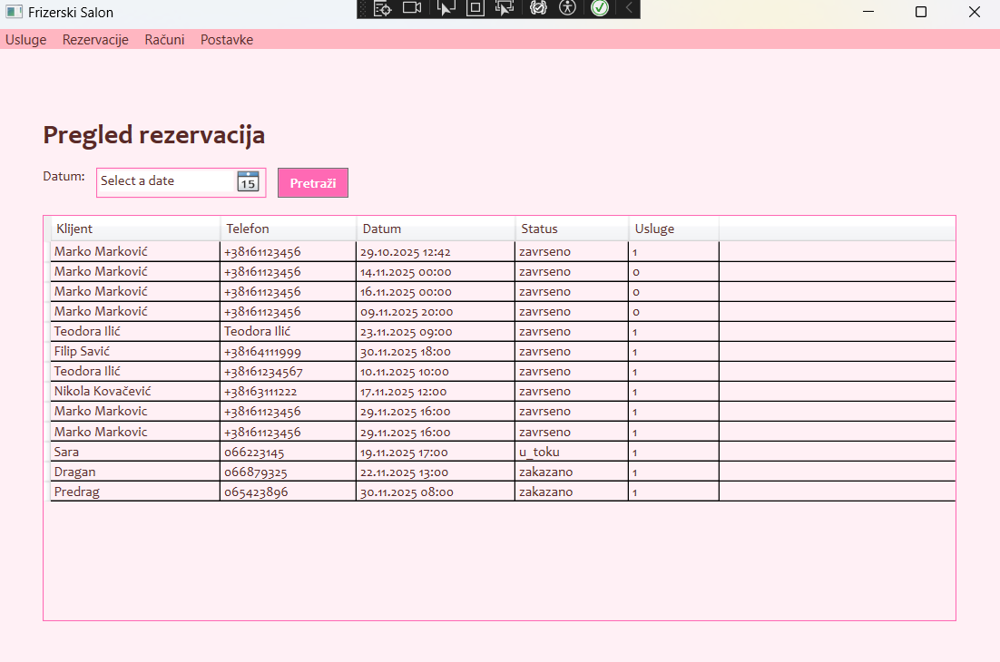

Administrator i radnik mogu **započeti** rezervaciju (prebaciti u „u_toku“) i **završiti** je (izdati račun).

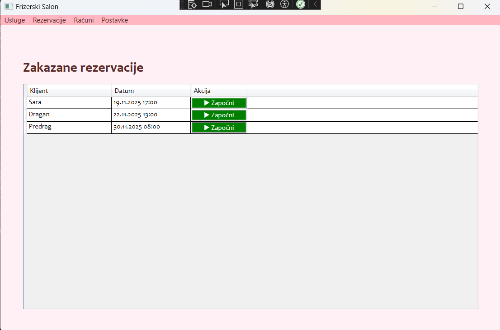
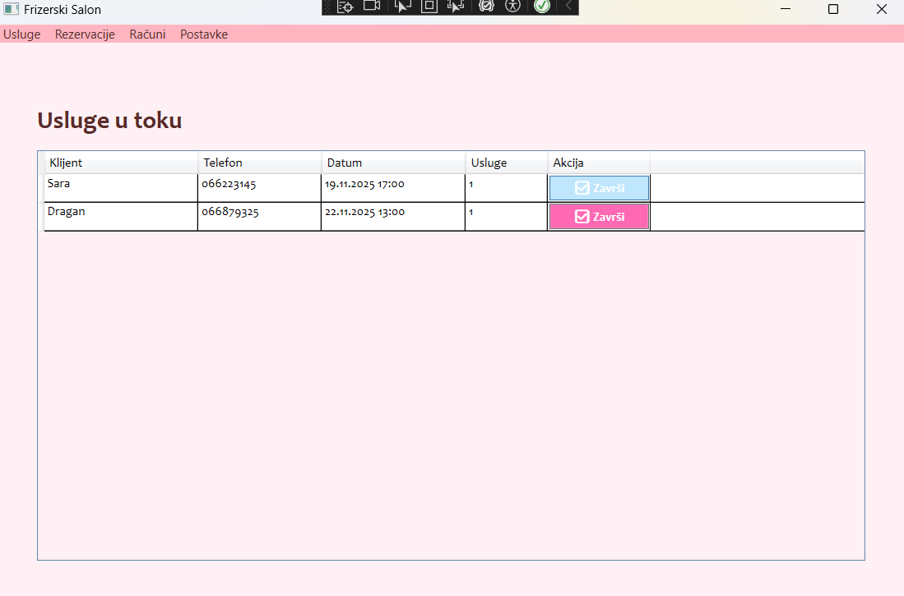

---

## Računi

### Automatsko izdavanje računa

Nakon završetka usluge (klikom na „✅ Završi“), sistem **automatski**:
1. Izračunava ukupnu cijenu na osnovu usluga
2. Kreira račun sa brojem, datumom i klijentom
3. Čuva račun u bazi

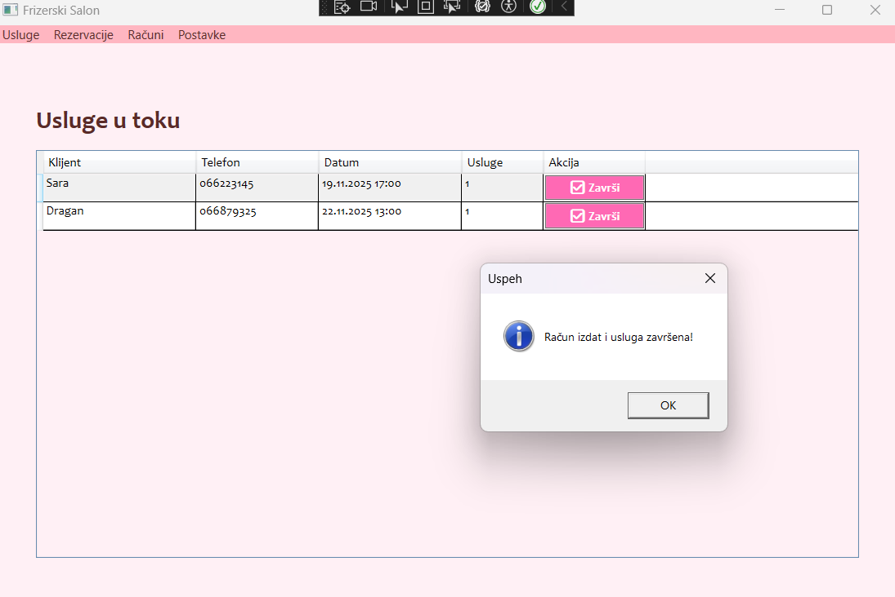

### Pregled i pretraga računa

Svi korisnici mogu:
- Pregledati sve račune
- Pretraživati račune po datumu

U tabeli se prikazuje:
- Broj računa
- Datum
- Klijent
- Ukupna cijena

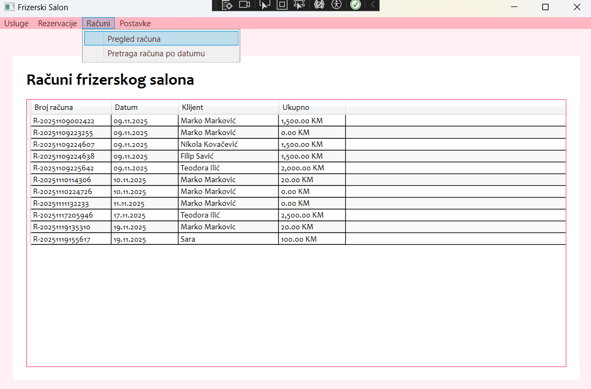
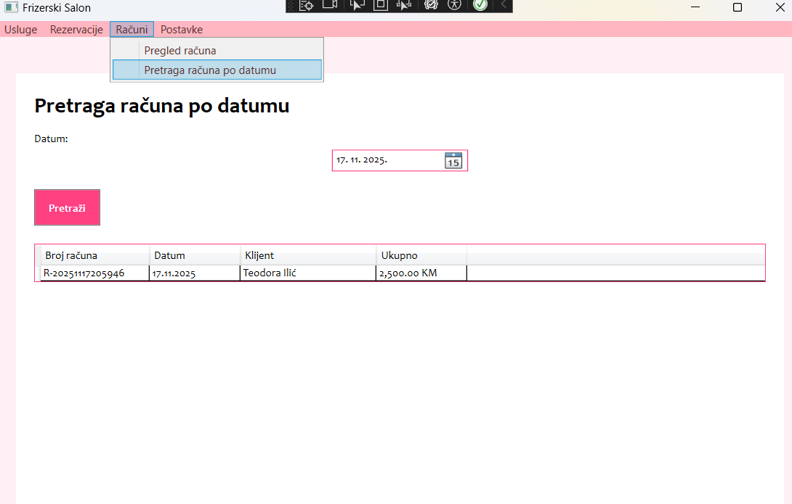

---

## Upravljanje korisnicima

Samo **administrator** može upravljati korisnicima sistema:
- **Dodavanje novog korisnika** – unos imena, prezimena, korisničkog imena, lozinke i uloge
- **Uređivanje postojećeg**
- **Brisanje korisnika**

Svaki korisnik ima:
- Korisničko ime
- Ulogu (**radnik** / **admin**)
- Preferiranu temu
- Jezik

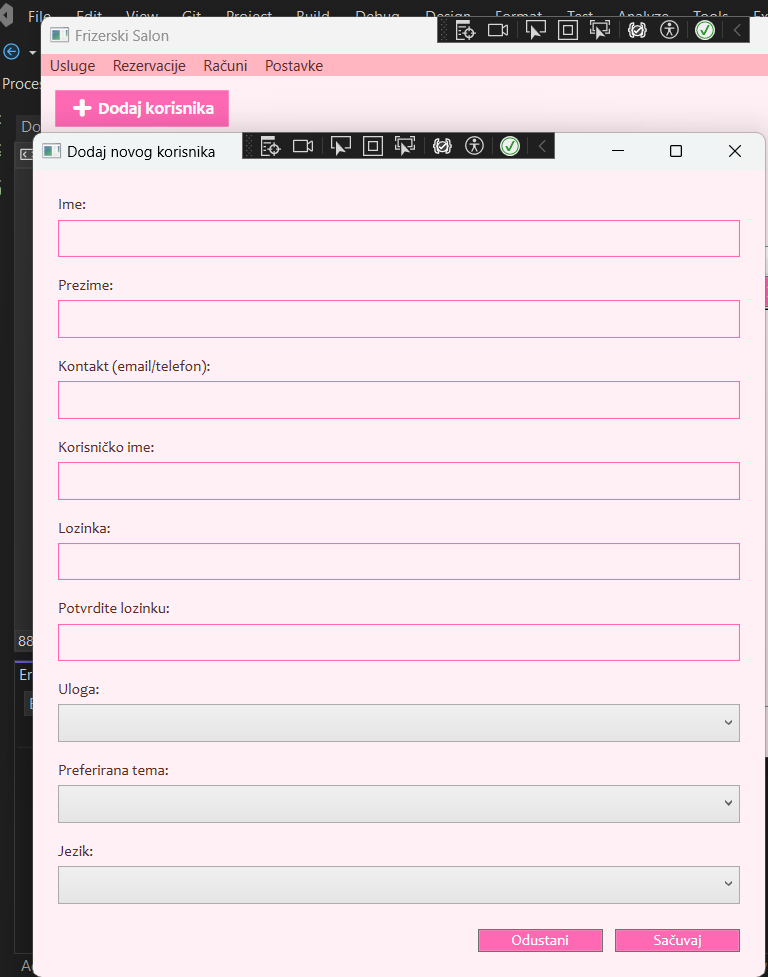
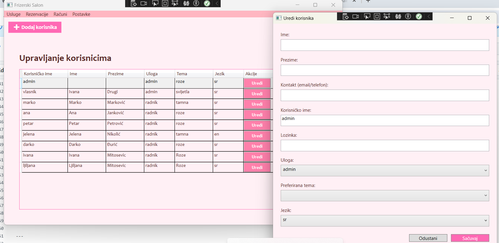
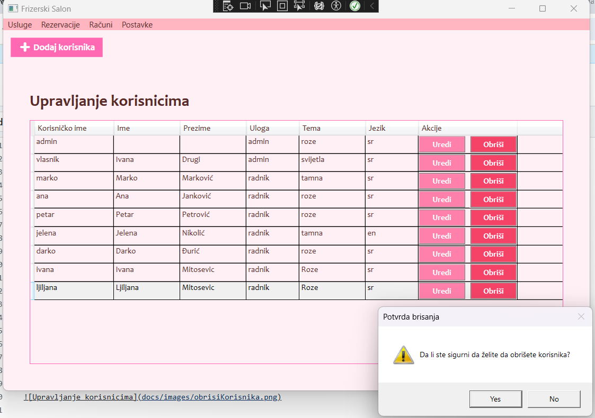

---

## Podešavanja

### Promjena teme

Svi korisnici mogu promijeniti vizuelni izgled aplikacije koji se nalazi u meniju u polju postavke:

- **Svijetla tema** – bijela pozadina, tamni tekst
- **Tamna tema** – tamna pozadina, svijetli tekst
- **Roze tema** – roze akcenti

Promjena teme se odmah primjenjuje i pamti se za svakog korisnika.

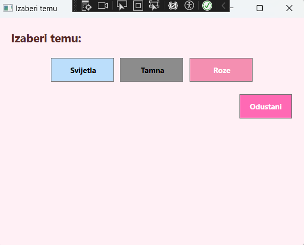

### Promjena jezika

Svi korisnici mogu birati jezik interfejsa:
- **Srpski** (sr)
- **English** (en)

Nakon promjene, cijela aplikacija se prebacuje na izabrani jezik.

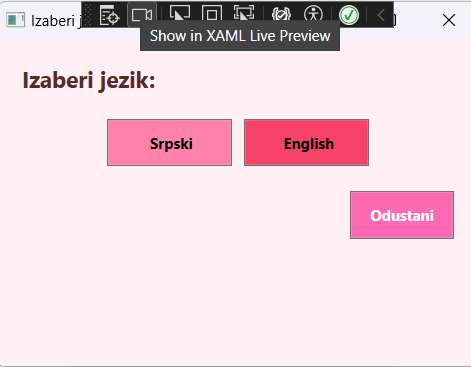

---

> **Frizerski salon © 2025**
